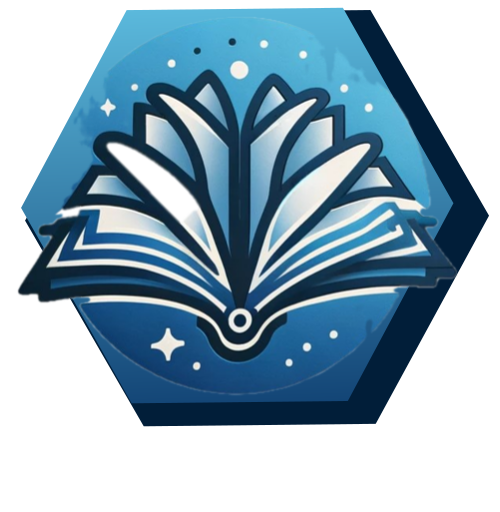

<p align="center">
  
</p>

[](https://github.com/astral-sh/ruff)


<h1 align="center">
GlossaGen
</h1>

<br>

<p align="center">
creating a glossary out of scholarly materials and chemistry reviews
</p>


## 🔥 Usage

Run `GlossaGen` to extract a glossary table from the command line:
```
glossagen # runs the program with the default paper
glossagen path/to/directory/containing/paper # the paper must be called paper.pdf
```

## 🎬 Demo

This project is part of the 2024 LLM Hackathon for Materials and Chemistry. Find the public submission of our project – including a product demo – [here](https://twitter.com/pschwllr). Thanks for leaving a ❤️, comment, repost or star!

Curious about example outputs of GlossaGen? Check out an intermediate Weights&Biases report [here](https://api.wandb.ai/links/mlederbauer/udrsalv6).

## 👩‍💻 Installation

Create a new environment and install the package: 

```
conda create -n glossagen python=3.10
conda activate glossagen
pip install -e .
```

**IMPORTANT**: Make sure you have a `.env` file in your project directory with an `OPENAI_API_KEY`.
```
# content of the .env file
OPENAI_API_KEY=sk-foo

# if you plan to generate knowledge graphs, provide Neo4J and Groq Credentials
NEO4J_URI=neo4j+s://foo
NEO4J_USERNAME=neo4j
NEO4J_PASSWORD=foo
GROQ_API_KEY=gsk_foo
```

## 🛠️ Development installation

To install, run

```
(glossagen) $ pip install -e ".[test,doc]"
```

### Run style checks, coverage, and tests

```
(glossagen) $ pip install tox
(glossagen) $ tox
```

### Generate coverage badge

Works after running `tox`

```
(glossagen) $ pip install "genbadge[coverage]"
(glossagen) $ genbadge coverage -i coverage.xml
```


